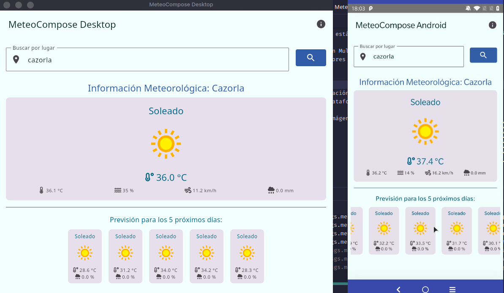
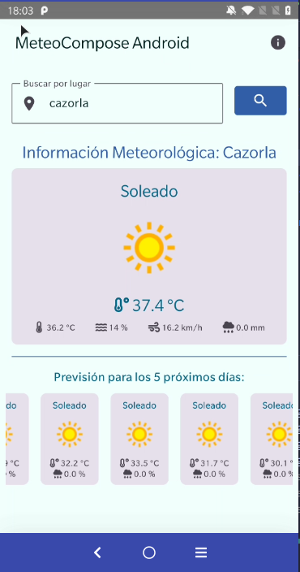
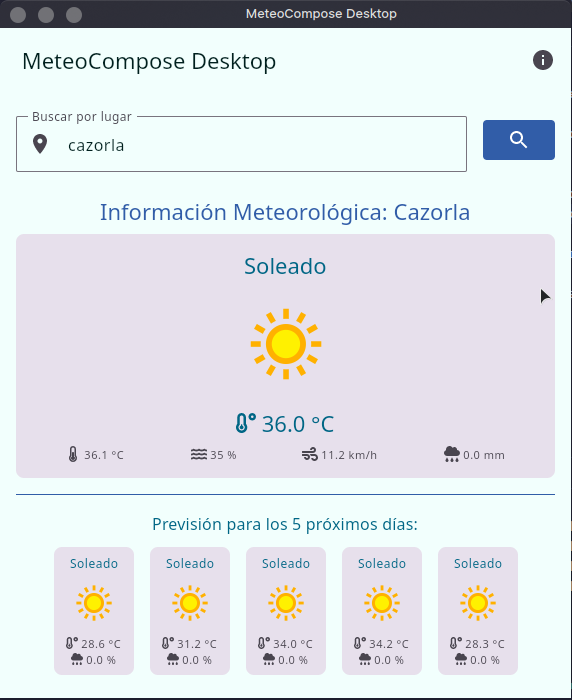

# MeteoCompose

Ejemplo de una sencilla aplicación de información meteorológica con Kotlin Multiplatform y Compose

## Acerca de

Este es un ejemplo de una aplicación de información meteorológica con Kotlin Multiplatform y Compose. Es un ejemplo muy
simple pero que muestra como podemos usar Compose en una aplicación multiplataforma. En este caso, la aplicación se
compone de un módulo Desktop y otro Android, pero podríamos añadir más módulos para iOS, Web, etc.

Entre las cosas que podemos ver en este ejemplo están:

- App de Android y Desktop con código compartido con Kotlin Multiplatform y Compose
- Material Design 3 con Compose con temas y colores
- Uso de Voyager para la navegación y gestion de rutas y estados de pantallas
- Uso de Coroutines para el manejo de asincronía
- Uso de Koin para la inyección de dependencias
- Uso de Ktor para la comunicación con la API
- Uso de Kotlinx Serialization para la serialización de datos
- Uso de Libres para manejo de recursos multiplataforma
- Uso de Compose ImageLoader para la carga de imágenes
- Gestión de estados mediante Railway Oriented Programming (ROP y LCE (Loading, Content, Error))
- Iconos de Material y Font Awesome

### Before running!

Check your system with KDoctor

- install JDK 8 on your machine
- add local.properties file to the project root and set a path to Android SDK there
- run ./gradlew podInstall in the project root

### Android

To run the application on android device/emulator:

- open project in Android Studio and run imported android run configuration

To build the application bundle:

- run `./gradlew :composeApp:assembleDebug`
- find `.apk` file in `composeApp/build/outputs/apk/debug/composeApp-debug.apk`

### Desktop

Run the desktop application: `./gradlew :composeApp:run`

## Autor

Codificado con :sparkling_heart: por [José Luis González Sánchez](https://twitter.com/JoseLuisGS_)

### Contacto

  Cualquier cosa que necesites házmelo saber por si puedo ayudarte 💬.

   &nbsp;&nbsp;
     &nbsp;&nbsp;
         &nbsp;&nbsp;
      &nbsp;&nbsp;
     &nbsp;&nbsp;
      &nbsp;&nbsp;
  

### ¿Un café?

   

## Licencia de uso

Este repositorio y todo su contenido está licenciado bajo licencia **Creative Commons**, si desea saber más, vea
la [LICENSE](https://joseluisgs.dev/docs/license/). Por favor si compartes, usas o modificas este proyecto cita a su
autor, y usa las mismas condiciones para su uso docente, formativo o educativo y no comercial.

 
JoseLuisGS
by <a xmlns:cc="http://creativecommons.org/ns#" href="https://joseluisgs.dev/" property="cc:attributionName" rel="cc:attributionURL">
José Luis González Sánchez</a> is licensed under
a <a rel="license" href="http://creativecommons.org/licenses/by-nc-sa/4.0/">Creative Commons
Reconocimiento-NoComercial-CompartirIgual 4.0 Internacional License</a>. Creado a partir de la obra
en <a xmlns:dct="http://purl.org/dc/terms/" href="https://github.com/joseluisgs" rel="dct:source">https://github.com/joseluisgs</a>.